# Cloudflared Mermaid Diagrams

This document provides rewrite-grade Mermaid diagrams for the repository's critical flows and structures. Each diagram type is chosen to match the kind of behavior being modeled.

## 1. Runtime Architecture Layers

Use case: structural overview.

Diagram type: `flowchart`.

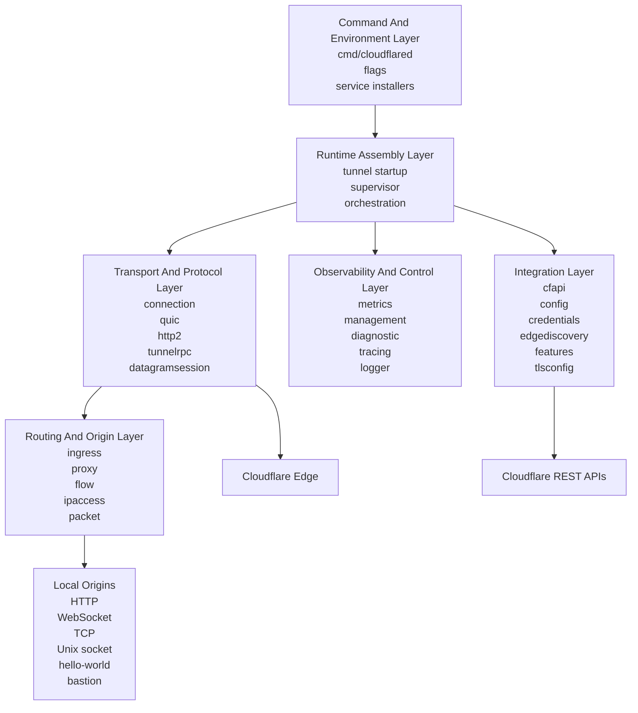
```mermaid
flowchart TD
    A[Command And Environment Layer\ncmd/cloudflared\nflags\nservice installers] --> B[Runtime Assembly Layer\ntunnel startup\nsupervisor\norchestration]
    B --> C[Transport And Protocol Layer\nconnection\nquic\nhttp2\ntunnelrpc\ndatagramsession]
    C --> D[Routing And Origin Layer\ningress\nproxy\nflow\nipaccess\npacket]
    B --> E[Observability And Control Layer\nmetrics\nmanagement\ndiagnostic\ntracing\nlogger]
    B --> F[Integration Layer\ncfapi\nconfig\ncredentials\nedgediscovery\nfeatures\ntlsconfig]
    D --> G[Local Origins\nHTTP\nWebSocket\nTCP\nUnix socket\nhello-world\nbastion]
    C --> H[Cloudflare Edge]
    F --> I[Cloudflare REST APIs]
```

## 2. Tunnel Daemon Startup Sequence

Use case: startup orchestration and responsibility handoff.

Diagram type: `sequenceDiagram`.

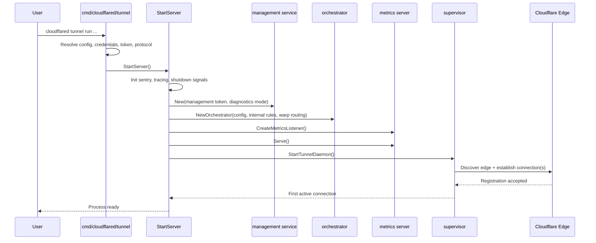
```mermaid
sequenceDiagram
    participant User
    participant CLI as cmd/cloudflared/tunnel
    participant Startup as StartServer
    participant Mgmt as management service
    participant Orch as orchestrator
    participant Metrics as metrics server
    participant Sup as supervisor
    participant Edge as Cloudflare Edge

    User->>CLI: cloudflared tunnel run ...
    CLI->>CLI: Resolve config, credentials, token, protocol
    CLI->>Startup: StartServer()
    Startup->>Startup: Init sentry, tracing, shutdown signals
    Startup->>Mgmt: New(management token, diagnostics mode)
    Startup->>Orch: NewOrchestrator(config, internal rules, warp routing)
    Startup->>Metrics: CreateMetricsListener()
    Startup->>Metrics: Serve()
    Startup->>Sup: StartTunnelDaemon()
    Sup->>Edge: Discover edge + establish connection(s)
    Edge-->>Sup: Registration accepted
    Sup-->>Startup: First active connection
    Startup-->>User: Process ready
```

## 3. Tunnel Mode Resolution

Use case: command behavior selection.

Diagram type: `flowchart`.

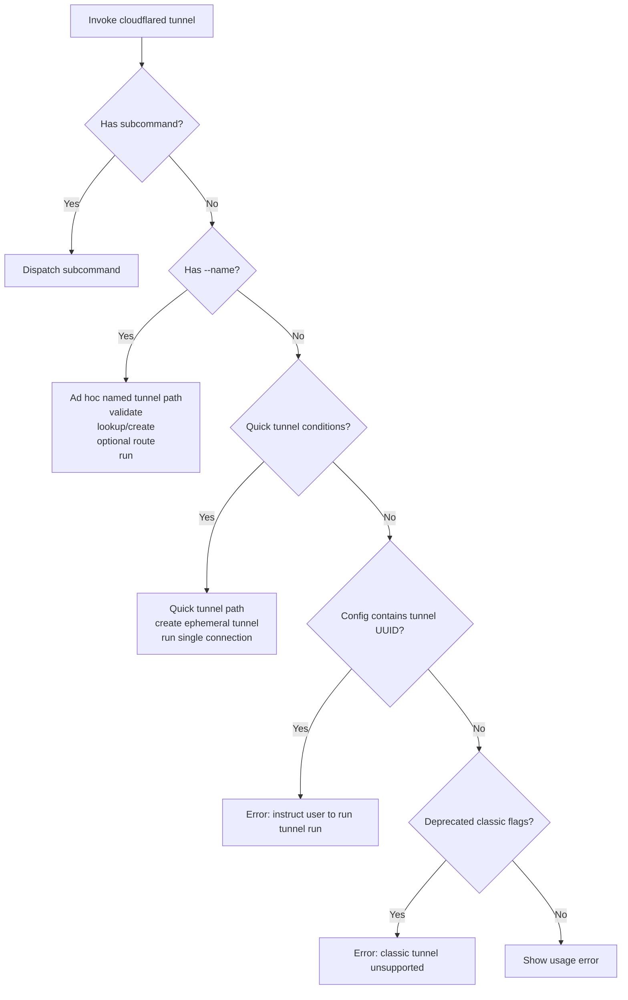
```mermaid
flowchart TD
    A[Invoke cloudflared tunnel] --> B{Has subcommand?}
    B -->|Yes| C[Dispatch subcommand]
    B -->|No| D{Has --name?}
    D -->|Yes| E[Ad hoc named tunnel path\nvalidate\nlookup/create\noptional route\nrun]
    D -->|No| F{Quick tunnel conditions?}
    F -->|Yes| G[Quick tunnel path\ncreate ephemeral tunnel\nrun single connection]
    F -->|No| H{Config contains tunnel UUID?}
    H -->|Yes| I[Error: instruct user to run tunnel run]
    H -->|No| J{Deprecated classic flags?}
    J -->|Yes| K[Error: classic tunnel unsupported]
    J -->|No| L[Show usage error]
```

## 4. Protocol Selection And Fallback State Machine

Use case: runtime transport behavior.

Diagram type: `stateDiagram-v2`.

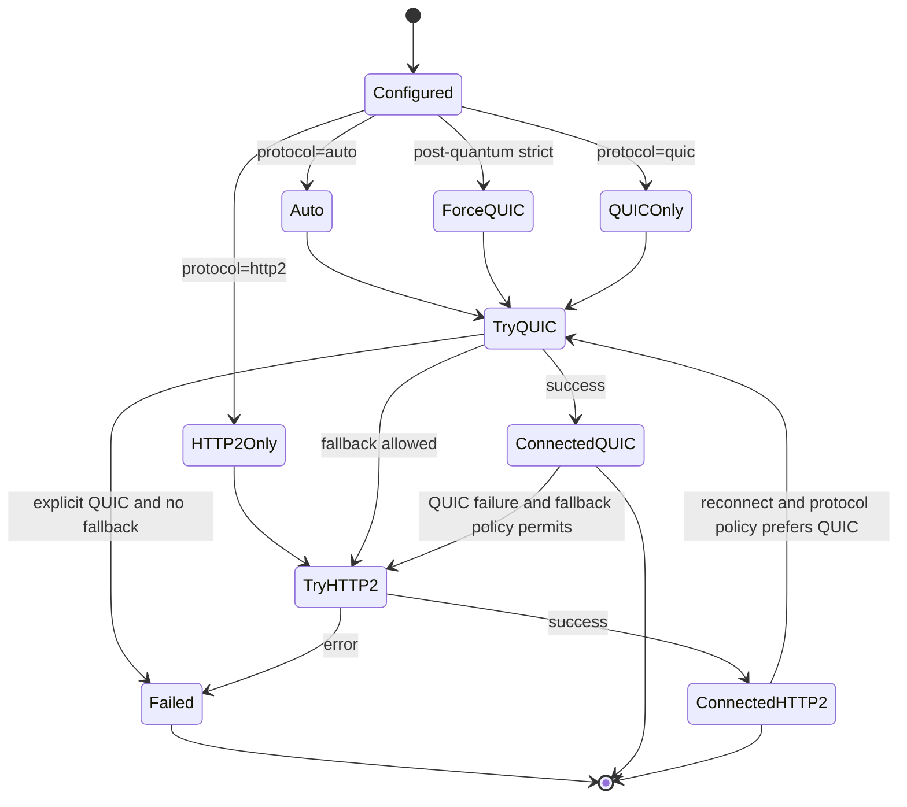
```mermaid
stateDiagram-v2
    [*] --> Configured
    Configured --> ForceQUIC: post-quantum strict
    Configured --> Auto: protocol=auto
    Configured --> HTTP2Only: protocol=http2
    Configured --> QUICOnly: protocol=quic

    Auto --> TryQUIC
    ForceQUIC --> TryQUIC
    QUICOnly --> TryQUIC
    HTTP2Only --> TryHTTP2

    TryQUIC --> ConnectedQUIC: success
    TryQUIC --> TryHTTP2: fallback allowed
    TryQUIC --> Failed: explicit QUIC and no fallback

    TryHTTP2 --> ConnectedHTTP2: success
    TryHTTP2 --> Failed: error

    ConnectedQUIC --> TryHTTP2: QUIC failure and fallback policy permits
    ConnectedHTTP2 --> TryQUIC: reconnect and protocol policy prefers QUIC

    Failed --> [*]
    ConnectedQUIC --> [*]
    ConnectedHTTP2 --> [*]
```

## 5. HTTP Request Routing Flow

Use case: ingress and proxy behavior.

Diagram type: `flowchart`.

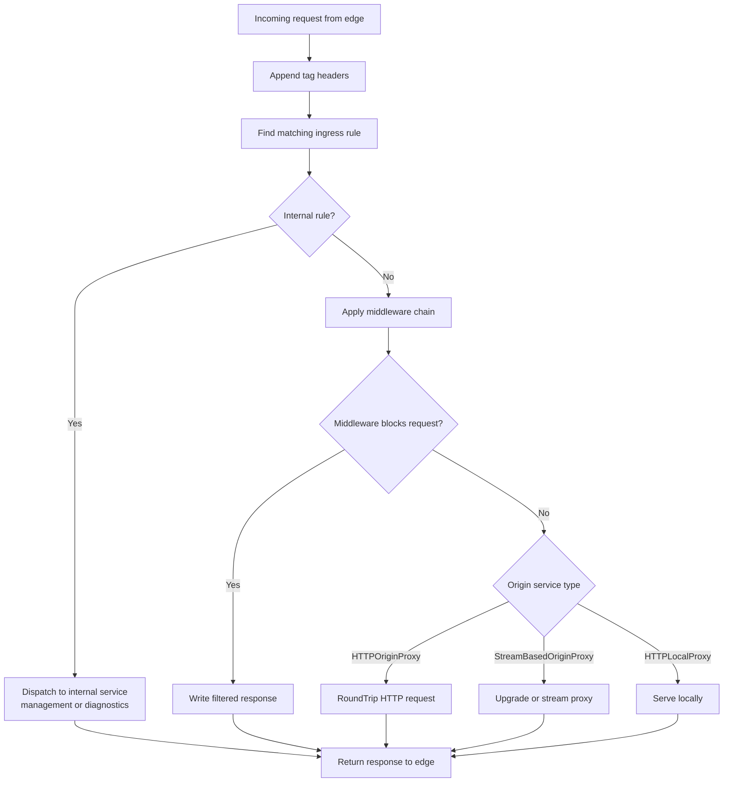
```mermaid
flowchart TD
    A[Incoming request from edge] --> B[Append tag headers]
    B --> C[Find matching ingress rule]
    C --> D{Internal rule?}
    D -->|Yes| E[Dispatch to internal service\nmanagement or diagnostics]
    D -->|No| F[Apply middleware chain]
    F --> G{Middleware blocks request?}
    G -->|Yes| H[Write filtered response]
    G -->|No| I{Origin service type}
    I -->|HTTPOriginProxy| J[RoundTrip HTTP request]
    I -->|StreamBasedOriginProxy| K[Upgrade or stream proxy]
    I -->|HTTPLocalProxy| L[Serve locally]
    J --> M[Return response to edge]
    K --> M
    L --> M
    E --> M
    H --> M
```

## 6. TCP Flow Handling

Use case: connection-limited stream forwarding.

Diagram type: `flowchart`.

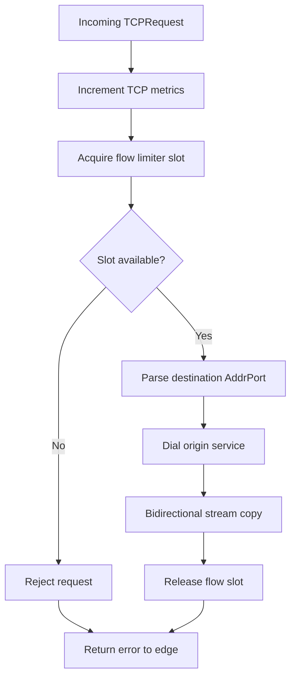
```mermaid
flowchart TD
    A[Incoming TCPRequest] --> B[Increment TCP metrics]
    B --> C[Acquire flow limiter slot]
    C --> D{Slot available?}
    D -->|No| E[Reject request]
    D -->|Yes| F[Parse destination AddrPort]
    F --> G[Dial origin service]
    G --> H[Bidirectional stream copy]
    H --> I[Release flow slot]
    E --> J[Return error to edge]
    I --> J
```

## 7. Remote Configuration Hot Reload

Use case: live config update semantics.

Diagram type: `sequenceDiagram`.

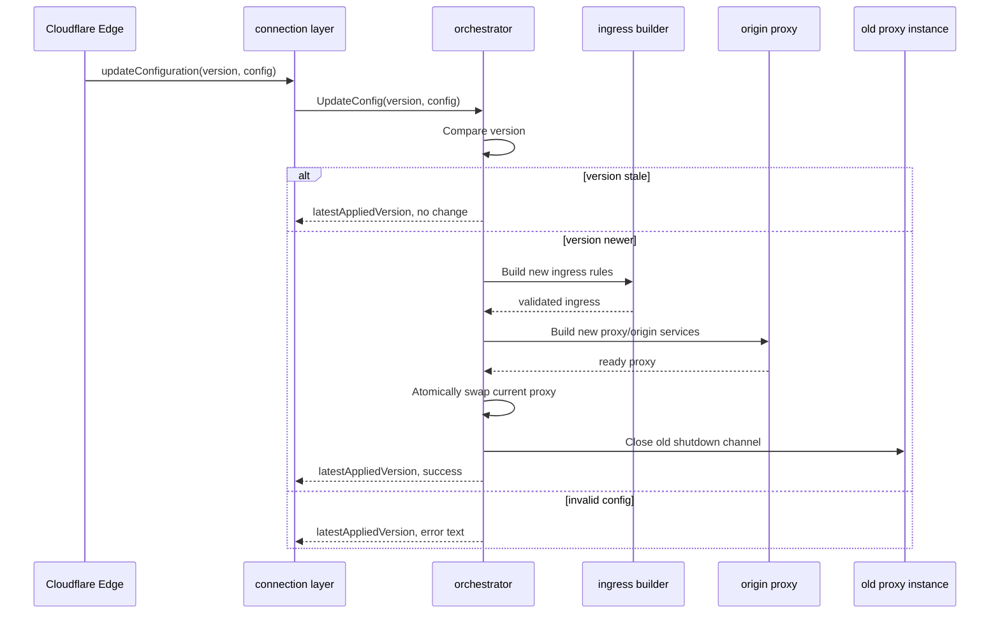
```mermaid
sequenceDiagram
    participant Edge as Cloudflare Edge
    participant Conn as connection layer
    participant Orch as orchestrator
    participant Ingress as ingress builder
    participant Proxy as origin proxy
    participant Old as old proxy instance

    Edge->>Conn: updateConfiguration(version, config)
    Conn->>Orch: UpdateConfig(version, config)
    Orch->>Orch: Compare version
    alt version stale
        Orch-->>Conn: latestAppliedVersion, no change
    else version newer
        Orch->>Ingress: Build new ingress rules
        Ingress-->>Orch: validated ingress
        Orch->>Proxy: Build new proxy/origin services
        Proxy-->>Orch: ready proxy
        Orch->>Orch: Atomically swap current proxy
        Orch->>Old: Close old shutdown channel
        Orch-->>Conn: latestAppliedVersion, success
    else invalid config
        Orch-->>Conn: latestAppliedVersion, error text
    end
```

## 8. Management Log Streaming Session

Use case: management WebSocket contract.

Diagram type: `sequenceDiagram`.

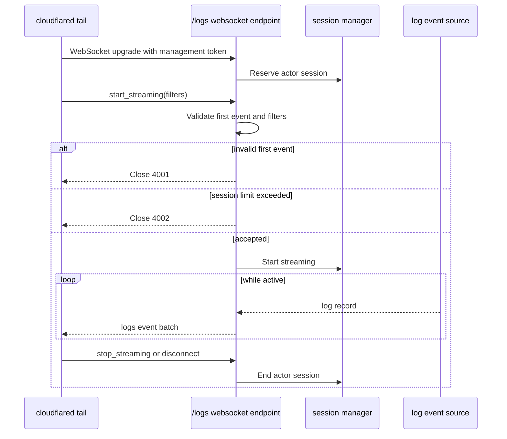
```mermaid
sequenceDiagram
    participant Tail as cloudflared tail
    participant Mgmt as /logs websocket endpoint
    participant Sess as session manager
    participant Log as log event source

    Tail->>Mgmt: WebSocket upgrade with management token
    Mgmt->>Sess: Reserve actor session
    Tail->>Mgmt: start_streaming(filters)
    Mgmt->>Mgmt: Validate first event and filters
    alt invalid first event
        Mgmt-->>Tail: Close 4001
    else session limit exceeded
        Mgmt-->>Tail: Close 4002
    else accepted
        Mgmt->>Sess: Start streaming
        loop while active
            Log-->>Mgmt: log record
            Mgmt-->>Tail: logs event batch
        end
        Tail->>Mgmt: stop_streaming or disconnect
        Mgmt->>Sess: End actor session
    end
```

## 9. Metrics And Readiness Exposure

Use case: liveness versus readiness semantics.

Diagram type: `flowchart`.

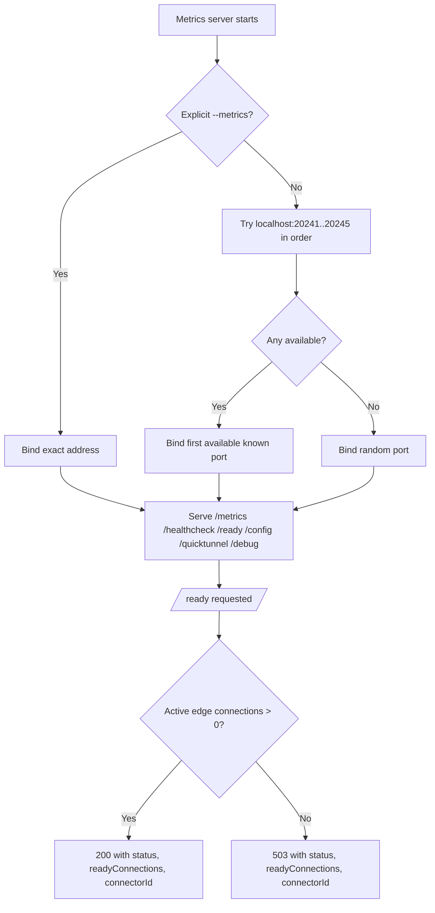
```mermaid
flowchart TD
    A[Metrics server starts] --> B{Explicit --metrics?}
    B -->|Yes| C[Bind exact address]
    B -->|No| D[Try localhost:20241..20245 in order]
    D --> E{Any available?}
    E -->|Yes| F[Bind first available known port]
    E -->|No| G[Bind random port]
    C --> H[Serve /metrics /healthcheck /ready /config /quicktunnel /debug]
    F --> H
    G --> H
    H --> I[/ready requested/]
    I --> J{Active edge connections > 0?}
    J -->|Yes| K[200 with status, readyConnections, connectorId]
    J -->|No| L[503 with status, readyConnections, connectorId]
```

## 10. Management Service Exposure Model

Use case: security and internal-rule placement.

Diagram type: `flowchart`.

```mermaid
flowchart LR
    A[Remote operator or tail client] --> B[Cloudflare management plane]
    B --> C[Management tunnel request]
    C --> D[Internal ingress rule]
    D --> E[management service mux]
    E --> F[/ping]
    E --> G[/logs websocket]
    E --> H[/host_details]
    E --> I{Diagnostics enabled?}
    I -->|Yes| J[/metrics]
    I -->|Yes| K[/debug/pprof/*]
    I -->|No| L[Diagnostics endpoints absent]
```

## 11. Supervisor Protocol Fallback Detail

Use case: detailed protocol fallback decision tree within supervisor.

Diagram type: `flowchart`.

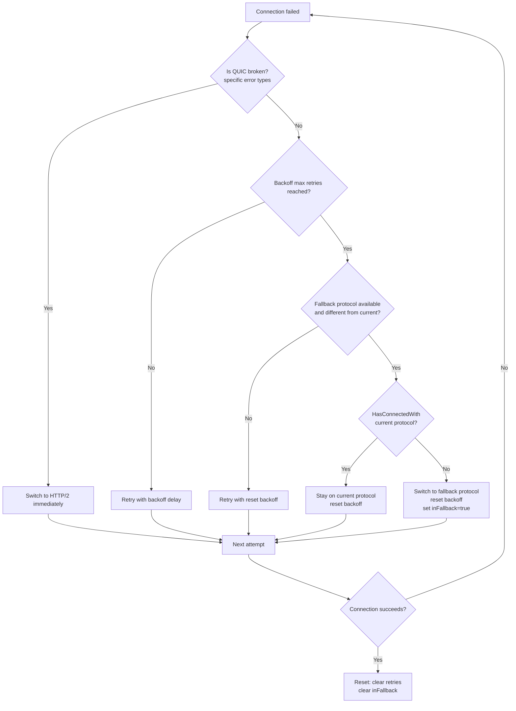
```mermaid
flowchart TD
    A[Connection failed] --> B{Is QUIC broken?
    specific error types}
    B -->|Yes| C[Switch to HTTP/2 immediately]
    B -->|No| D{Backoff max retries reached?}
    D -->|No| E[Retry with backoff delay]
    D -->|Yes| F{Fallback protocol available
and different from current?}
    F -->|No| G[Retry with reset backoff]
    F -->|Yes| H{HasConnectedWith
current protocol?}
    H -->|Yes| I[Stay on current protocol
reset backoff]
    H -->|No| J[Switch to fallback protocol
reset backoff
set inFallback=true]
    C --> K[Next attempt]
    E --> K
    G --> K
    I --> K
    J --> K
    K --> L{Connection succeeds?}
    L -->|Yes| M[Reset: clear retries
clear inFallback]
    L -->|No| A
```

## 12. Bastion And SOCKS Proxy Flow

Use case: bastion/SOCKS request handling path.

Diagram type: `flowchart`.

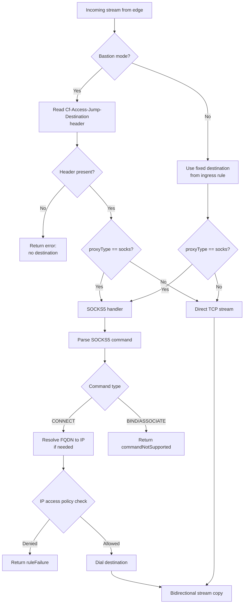
```mermaid
flowchart TD
    A[Incoming stream from edge] --> B{Bastion mode?}
    B -->|No| C[Use fixed destination
from ingress rule]
    B -->|Yes| D[Read Cf-Access-Jump-Destination
header]
    D --> E{Header present?}
    E -->|No| F[Return error:
no destination]
    E -->|Yes| G{proxyType == socks?}
    G -->|Yes| H[SOCKS5 handler]
    G -->|No| I[Direct TCP stream]
    C --> J{proxyType == socks?}
    J -->|Yes| H
    J -->|No| I
    H --> K[Parse SOCKS5 command]
    K --> L{Command type}
    L -->|CONNECT| M[Resolve FQDN to IP
if needed]
    L -->|BIND/ASSOCIATE| N[Return commandNotSupported]
    M --> O{IP access policy check}
    O -->|Denied| P[Return ruleFailure]
    O -->|Allowed| Q[Dial destination]
    Q --> R[Bidirectional stream copy]
    I --> R
```

## 13. Access Token Lifecycle

Use case: Access token fetch, cache, and refresh lifecycle.

Diagram type: `sequenceDiagram`.

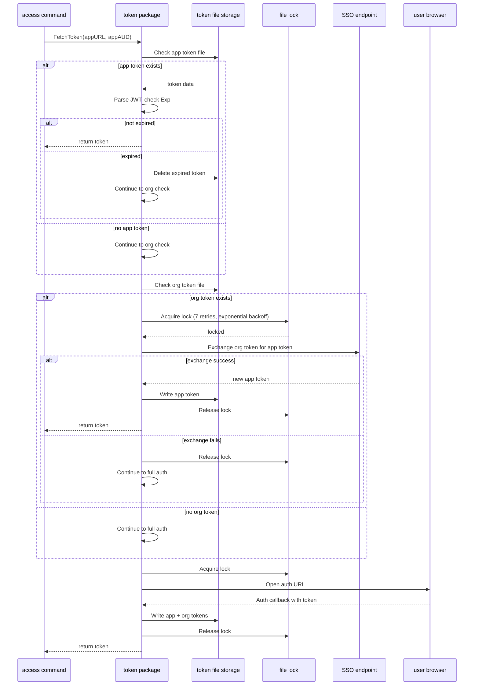
```mermaid
sequenceDiagram
    participant Client as access command
    participant Token as token package
    participant Disk as token file storage
    participant Lock as file lock
    participant SSO as SSO endpoint
    participant Browser as user browser

    Client->>Token: FetchToken(appURL, appAUD)
    Token->>Disk: Check app token file
    alt app token exists
        Disk-->>Token: token data
        Token->>Token: Parse JWT, check Exp
        alt not expired
            Token-->>Client: return token
        else expired
            Token->>Disk: Delete expired token
            Token->>Token: Continue to org check
        end
    else no app token
        Token->>Token: Continue to org check
    end
    Token->>Disk: Check org token file
    alt org token exists
        Token->>Lock: Acquire lock (7 retries, exponential backoff)
        Lock-->>Token: locked
        Token->>SSO: Exchange org token for app token
        alt exchange success
            SSO-->>Token: new app token
            Token->>Disk: Write app token
            Token->>Lock: Release lock
            Token-->>Client: return token
        else exchange fails
            Token->>Lock: Release lock
            Token->>Token: Continue to full auth
        end
    else no org token
        Token->>Token: Continue to full auth
    end
    Token->>Lock: Acquire lock
    Token->>Browser: Open auth URL
    Browser-->>Token: Auth callback with token
    Token->>Disk: Write app + org tokens
    Token->>Lock: Release lock
    Token-->>Client: return token
```

## 14. Edge Discovery And Address Pool

Use case: edge resolution and address assignment.

Diagram type: `sequenceDiagram`.

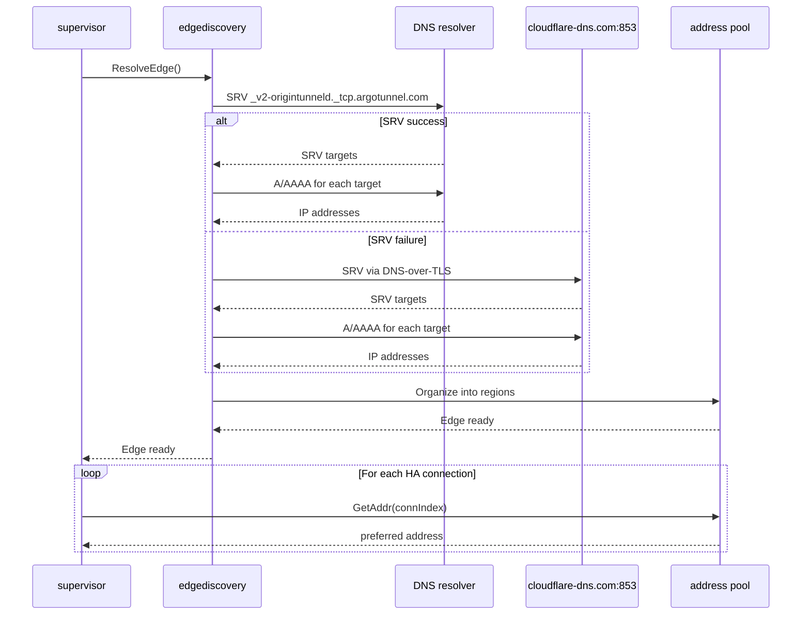
```mermaid
sequenceDiagram
    participant Sup as supervisor
    participant ED as edgediscovery
    participant DNS as DNS resolver
    participant DoT as cloudflare-dns.com:853
    participant Pool as address pool

    Sup->>ED: ResolveEdge()
    ED->>DNS: SRV _v2-origintunneld._tcp.argotunnel.com
    alt SRV success
        DNS-->>ED: SRV targets
        ED->>DNS: A/AAAA for each target
        DNS-->>ED: IP addresses
    else SRV failure
        ED->>DoT: SRV via DNS-over-TLS
        DoT-->>ED: SRV targets
        ED->>DoT: A/AAAA for each target
        DoT-->>ED: IP addresses
    end
    ED->>Pool: Organize into regions
    Pool-->>ED: Edge ready
    ED-->>Sup: Edge ready

    loop For each HA connection
        Sup->>Pool: GetAddr(connIndex)
        Pool-->>Sup: preferred address
    end
```

## 15. HTTP/2 Stream Type Dispatch

Use case: HTTP/2 stream classification priority.

Diagram type: `flowchart`.

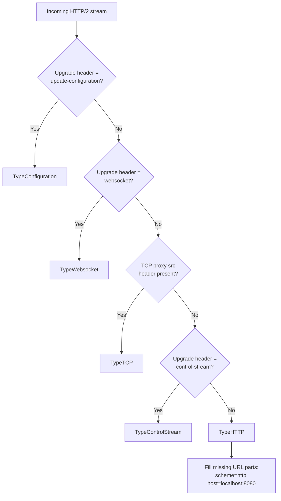
```mermaid
flowchart TD
    A[Incoming HTTP/2 stream] --> B{Upgrade header =
update-configuration?}
    B -->|Yes| C[TypeConfiguration]
    B -->|No| D{Upgrade header =
websocket?}
    D -->|Yes| E[TypeWebsocket]
    D -->|No| F{TCP proxy src
header present?}
    F -->|Yes| G[TypeTCP]
    F -->|No| H{Upgrade header =
control-stream?}
    H -->|Yes| I[TypeControlStream]
    H -->|No| J[TypeHTTP]
    J --> K[Fill missing URL parts:
scheme=http host=localhost:8080]
```

## 16. Datagram V2 Versus V3 Encoding Comparison

Use case: wire format encoding difference.

Diagram type: `flowchart`.

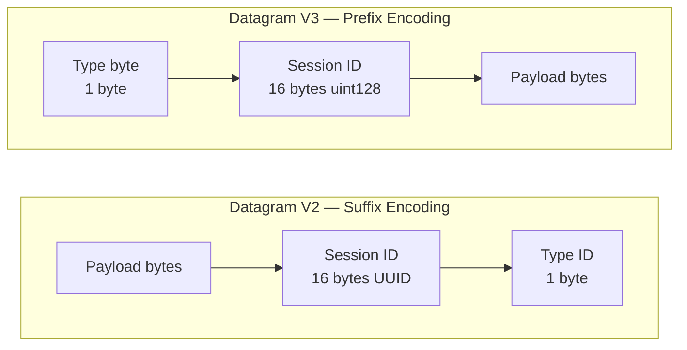
```mermaid
flowchart LR
    subgraph V2 ["Datagram V2 — Suffix Encoding"]
        direction LR
        A1[Payload bytes] --> A2[Session ID\n16 bytes UUID] --> A3[Type ID\n1 byte]
    end
    subgraph V3 ["Datagram V3 — Prefix Encoding"]
        direction LR
        B1[Type byte\n1 byte] --> B2[Session ID\n16 bytes uint128] --> B3[Payload bytes]
    end
```

## 17. Orchestrator Config Update Sequence

Use case: start-before-stop proxy swap during config hot-reload.

Diagram type: `sequenceDiagram`.

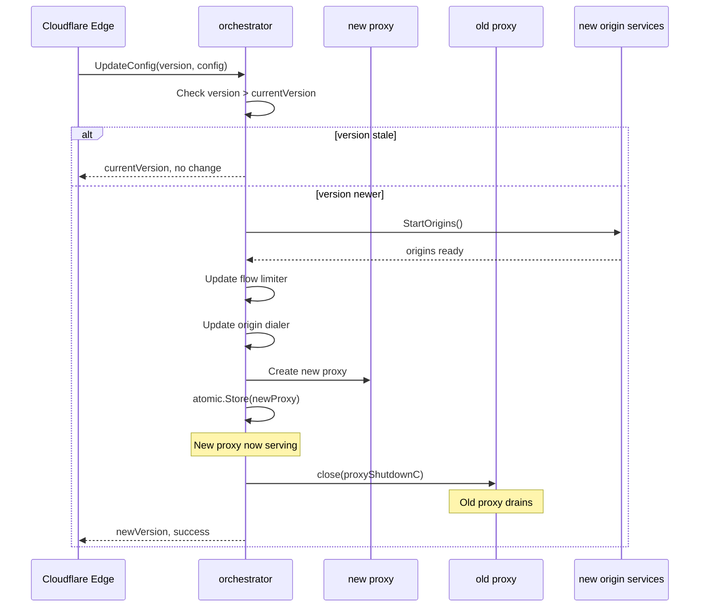
```mermaid
sequenceDiagram
    participant Edge as Cloudflare Edge
    participant Orch as orchestrator
    participant NewProxy as new proxy
    participant OldProxy as old proxy
    participant Origins as new origin services

    Edge->>Orch: UpdateConfig(version, config)
    Orch->>Orch: Check version > currentVersion
    alt version stale
        Orch-->>Edge: currentVersion, no change
    else version newer
        Orch->>Origins: StartOrigins()
        Origins-->>Orch: origins ready
        Orch->>Orch: Update flow limiter
        Orch->>Orch: Update origin dialer
        Orch->>NewProxy: Create new proxy
        Orch->>Orch: atomic.Store(newProxy)
        Note over Orch: New proxy now serving
        Orch->>OldProxy: close(proxyShutdownC)
        Note over OldProxy: Old proxy drains
        Orch-->>Edge: newVersion, success
    end
```

## 18. Rewrite Diagram Usage Guide

- Use the architecture flowchart to preserve subsystem boundaries.
- Use the startup and hot-reload sequence diagrams to preserve ordering-sensitive behavior.
- Use the protocol state machine to preserve fallback and PQ semantics.
- Use the routing and TCP flowcharts to preserve request-path invariants.
- Use the management sequence diagram to preserve token-gated remote operations.
- Use the supervisor fallback detail to preserve retry/backoff/HasConnectedWith semantics.
- Use the bastion/SOCKS flow to preserve IP access evaluation order and FQDN resolution quirks.
- Use the access token lifecycle to preserve lock, expiry, and multi-level fallback behavior.
- Use the edge discovery diagram to preserve SRV/DoT fallback and address pool stickiness.
- Use the HTTP/2 stream type dispatch to preserve request classification priority.
- Use the V2/V3 encoding comparison to preserve datagram byte ordering.
- Use the orchestrator config update sequence to preserve start-before-stop swap ordering.
